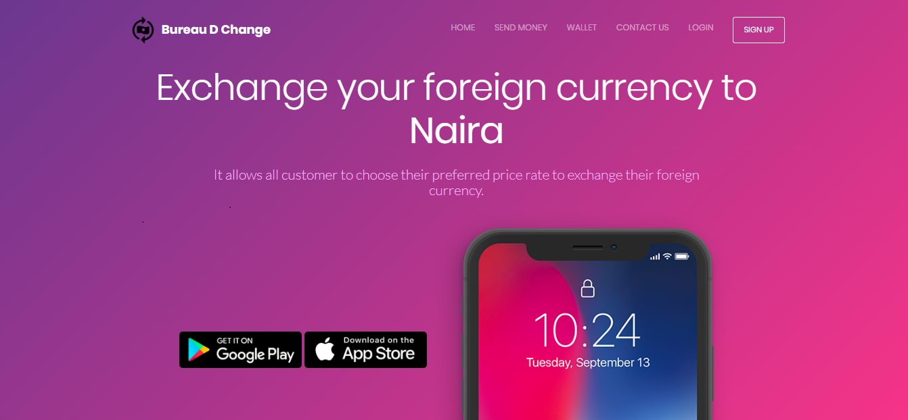
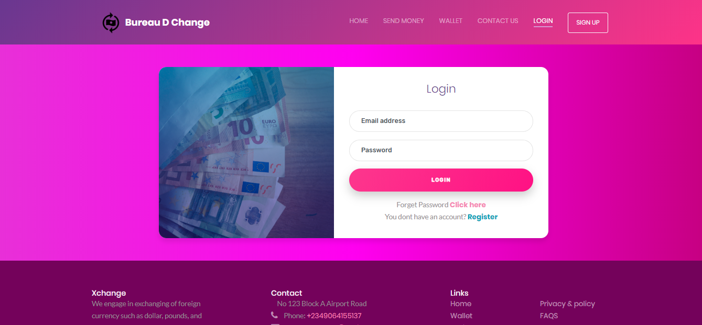
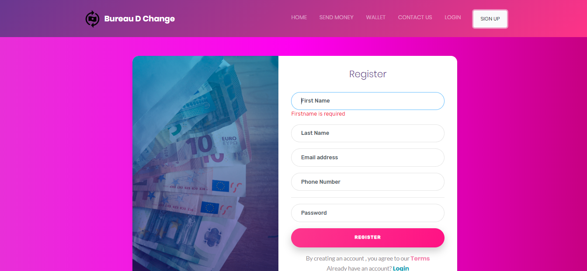
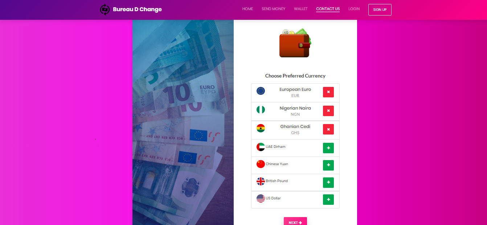
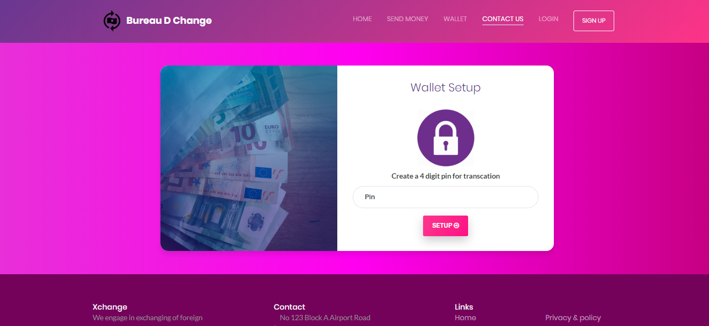
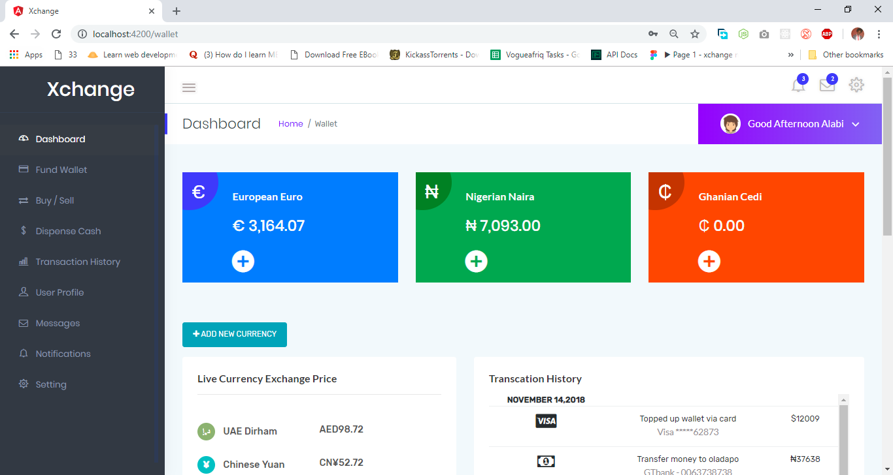
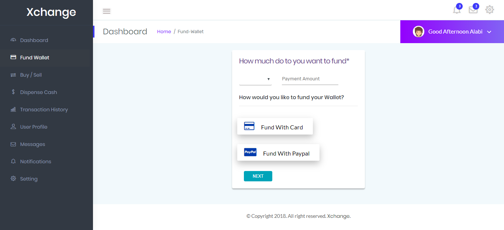
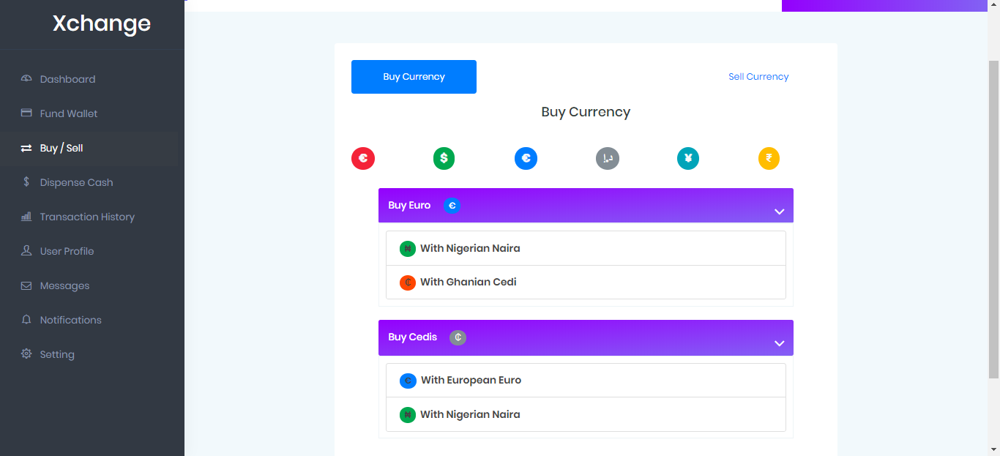
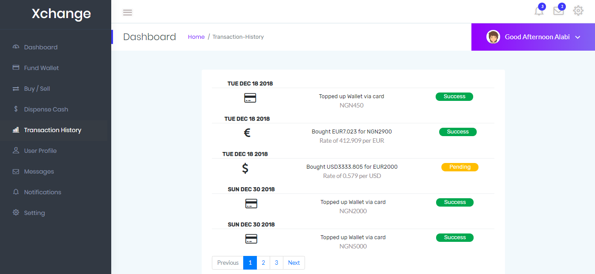

# Bureau D Change

This is web solution that you can use to exchange your foreign currency to Naira offering you  best rate which 
no exchanger can offer you.

Support me by visiting below URL and comment to assist to make the project better.

https://xchangemaja.firebaseapp.com

Homepage has been implemented
User Profile have been implemented
User Withdrawal and summary has been implemented

# Screenshots
&nbsp;
&nbsp;
&nbsp;
&nbsp;
&nbsp;
&nbsp;
&nbsp;
&nbsp;

# Author : Alabi Temitope 
